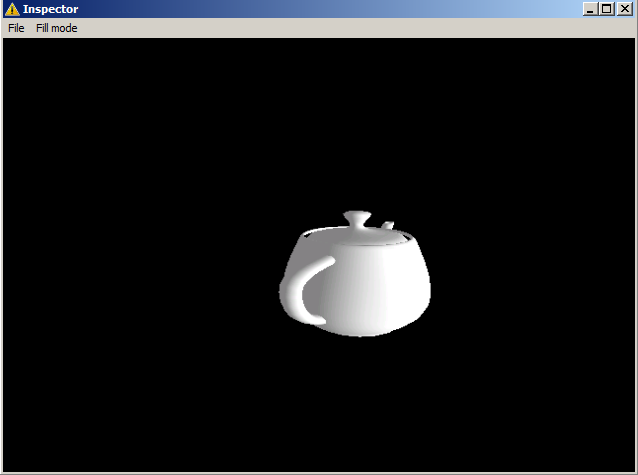

# XInspector
A simple project I've created in approximately two days of work, it initially loads *Utah teapot* using **D3DXCreateTeapot()**, offers a menu that allows importing an *external **.X model*** and switching **Fill mode** between *D3DFILL_SOLID* and *D3DFILL_WIREFRAME*.
\
The executable offers interactivity by handling **WM_MOUSEMOUSE** mainly, by calculating the center of the window on certain circumstances:

 - When the window is first created(**WM_CREATE**).
 - When the window is resized(**WM_SIZE**).
 - When the window position is changed(**WM_WINDOWPOSCHANGED**).

A boolean is used to track the window state by monitoring **WM_ACTIVATE** messages;\
The world comes with a directional light pointing towards +Z axis.\
\
\
\
Most models which are loaded with **D3DXLoadMeshFromX()** are large in size by nature and have to be scaled down in order to fit and adhere the *constant movement speed*.
\
This is possible with **WM_MOUSEWHEEL** giving a Delta's sign upon which the scaling happens (+/- 1e-2).